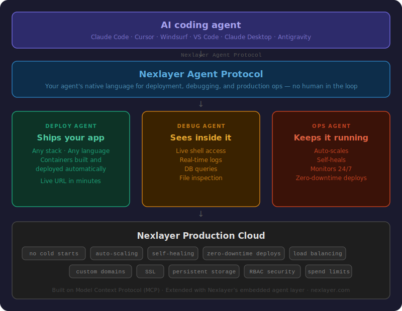

<p align="center">
  <a href="https://nexlayer.com">
    
  </a>
</p>

<p align="center">
  <strong>The agentic cloud platform that deploys your code.</strong>
</p>

<p align="center">
  <a href="https://nexlayer.com/docs">Documentation</a> •
  <a href="https://nexlayer.com/resources/templates">Templates</a> •
  <a href="https://nexlayer.com/resources/use-cases">Use Cases</a> •
  <a href="https://nexlayer.com/resources/changelog">Changelog</a> •
  <a href="https://join.slack.com/t/nexlayercommunity/shared_invite/zt-3ns0038s0-16GWdSAD1aPdyxDzmbGaiw">Community</a>
</p>

---

## What is Nexlayer?

**Nexlayer is an agentic cloud platform where AI agents deploy, scale, and manage your applications autonomously—you describe what you want, and the platform handles the rest.**

No Kubernetes expertise. No YAML sprawl. No 3 AM pages. Just ship it.

---

## How It Works

```
┌─────────────────────────────────────────────────────────────────────────────┐
│                           AGENTIC CLOUD ARCHITECTURE                        │
└─────────────────────────────────────────────────────────────────────────────┘

     YOU                          NEXLAYER                         CLOUD
      │                              │                               │
      │  "Deploy my app"             │                               │
      │  ─────────────────────────►  │                               │
      │                              │                               │
      │                    ┌─────────▼─────────┐                     │
      │                    │  NEXLAYER AGENT   │                     │
      │                    │  ┌─────────────┐  │                     │
      │                    │  │ Analyze     │  │                     │
      │                    │  │ Configure   │  │                     │
      │                    │  │ Provision   │  │                     │
      │                    │  │ Deploy      │  │                     │
      │                    │  │ Monitor     │  │                     │
      │                    │  └─────────────┘  │                     │
      │                    └─────────┬─────────┘                     │
      │                              │                               │
      │                              │  Autonomous orchestration     │
      │                              │  ─────────────────────────►   │
      │                              │                               │
      │                              │         ┌─────────────────────▼───┐
      │                              │         │  YOUR APP RUNNING       │
      │                              │         │  • Auto-scaled          │
      │                              │         │  • Auto-healed          │
      │                              │         │  • Cost-optimized       │
      │  Live URL + dashboard        │         └─────────────────────────┘
      │  ◄─────────────────────────  │                               │
      │                              │                               │
```

### The Agentic Difference

Traditional cloud: You write infrastructure code → You debug infrastructure code → You maintain infrastructure code forever.

**Agentic cloud:** You describe intent → Agents handle infrastructure → You focus on your product.

| Traditional DevOps | Nexlayer |
|-------------------|----------|
| Write Dockerfiles, Kubernetes manifests, Terraform | Describe your app in plain English or simple YAML |
| Debug networking, DNS, certificates, ingress | Agents configure networking automatically |
| Monitor dashboards, set up alerts, respond to pages | Agents detect and fix issues before you notice |
| Estimate capacity, over-provision "just in case" | Agents scale precisely to demand |

---

## What Lives Under the Hood

Three specialized agents — each with a single job — sit between your coding agent and your production infrastructure. One protocol connects them all.

<p align="center">
  
</p>

*Your coding agent sees one connection and one result. The three agents handle all complexity internally — your context window stays clean, your shipping loop stays fast.*

---

## Three Anxieties We Eliminate

### 1. Deployment Anxiety
*"What if I break production?"*

Every deployment gets its own isolated environment with a unique URL. Test it, share it, verify it—then promote to production when ready. Rollback is one click. Agents validate health before routing traffic.

### 2. Scaling Anxiety
*"What if we get featured on Hacker News?"*

Agents monitor traffic patterns and scale automatically. No capacity planning. No manual intervention. Your app handles the spike while you enjoy the moment.

### 3. Bill Shock
*"What if I wake up to a $50,000 bill?"*

**We built explicit protection into the platform:**

| Status | What It Means |
|--------|---------------|
| 🟢 **Green** | Running normally, within your credit ceiling |
| 🟡 **Amber** | Approaching limit—we email you with options |
| 🔴 **Red** | Credit ceiling reached—**apps are paused, not deleted** |

**The guarantee:** Nothing is lost without your permission. Your apps pause gracefully. Your data stays intact. You decide what happens next—add credits, optimize, or wind down. No surprise charges. No panic. No lost work.

---

## Quick Start

Connect Nexlayer to your AI coding assistant:

```bash
npx @nexlayer/mcp-install
```

Then just tell your assistant: *"Deploy this to Nexlayer"*

That's it. One command. Your agent handles the rest.

**[Quickstart guide →](https://nexlayer.com/docs/quickstart)**

---

## Ship Anything

| Stack | What's in it |
|-------|--------------|
| **Real-time Platform** | Vue/Nuxt frontend · Go/gRPC API · MySQL · RabbitMQ |
| **ML Pipeline** | Svelte dashboard · Python/Flask API · PostgreSQL · PyTorch/CUDA GPU worker |
| **Mobile Backend** | Ruby/Rails API · PostgreSQL · MinIO S3 storage · Sidekiq/Redis workers |
| **E-commerce** | Next.js/React/Tailwind frontend · Node/Express/TypeScript API · PostgreSQL/Prisma · Redis cache |

Any stack. Any language. Any container. If it runs, it ships.

---

## Use Cases

| Who you are | What you ship on Nexlayer |
|-------------|---------------------------|
| **Vibe coder** | Your AI-built app goes from "works on my machine" to live URL — without touching a terminal |
| **Indie hacker** | Ship your MVP tonight. Handle the Hacker News spike tomorrow. Never re-platform. |
| **AI/LLM builder** | Agent SDKs, RAG pipelines, custom models, Claude/OpenAI wrappers — long-running, always-on, no cold starts |
| **MCP server developer** | Build and host your MCP server in one place. Your agent deploys it. |
| **Freelancer** | Every client gets their own environment. You bill for building, not DevOps. |
| **Startup founder** | Production-grade from day one. Your investor gets a real link, not a localhost screenshot. |
| **Designer / PM** | You learned to code with AI. Now you can ship too. |
| **Open source self-hoster** | n8n, Supabase, Ghost, Metabase — your data, your infra, a fraction of SaaS cost. |

**[Explore all use cases →](https://nexlayer.com/resources/use-cases)**

---

## Resources

| Resource | Description |
|----------|-------------|
| [**Quickstart**](https://nexlayer.com/docs/quickstart) | Get deployed in under 5 minutes |
| [**MCP Setup**](https://nexlayer.com/docs/mcp/overview) | Connect your AI coding assistant |
| [**Claude Code Setup**](https://nexlayer.com/docs/mcp/claude-code) | Setup guide for Claude Code |
| [**Cursor Setup**](https://nexlayer.com/docs/mcp/cursor) | Setup guide for Cursor |
| [**Configuration**](https://nexlayer.com/docs/deployments/configuration) | nexlayer.yaml reference |
| [**Custom Domains**](https://nexlayer.com/docs/deployments/custom-domains) | Use your own domain |
| [**For AI Agents**](https://nexlayer.com/docs/agents/overview) | Build agents that deploy |
| [**Templates**](https://nexlayer.com/resources/templates) | Pre-built stacks: Next.js, FastAPI, Rails, and more |
| [**Changelog**](https://nexlayer.com/resources/changelog) | What's new and what's next |
| [**Community Slack**](https://join.slack.com/t/nexlayercommunity/shared_invite/zt-3ns0038s0-16GWdSAD1aPdyxDzmbGaiw) | Get help, share feedback, connect with the team |

---

## FAQ

<details>
<summary><strong>Is Nexlayer open source?</strong></summary>

No. Nexlayer is a managed platform. This repository contains documentation, examples, and community resources—not the platform source code.
</details>

<details>
<summary><strong>What happens to my data if I stop paying?</strong></summary>

Apps pause. Data persists. We email you. You have 30 days to export or resume. Nothing is deleted without explicit confirmation from you.
</details>

<details>
<summary><strong>Can I use my own Kubernetes cluster?</strong></summary>

Currently, Nexlayer runs on our managed infrastructure. Bring-your-own-cloud options are on the roadmap.
</details>

<details>
<summary><strong>How is this different from Vercel/Railway/Render?</strong></summary>

Those platforms require you to configure deployments. Nexlayer agents figure out the configuration. You describe intent; agents handle implementation. It's the difference between writing infrastructure and describing outcomes.
</details>

<details>
<summary><strong>Does Nexlayer use MCP?</strong></summary>

Yes. The Nexlayer Agent Protocol is built on [Model Context Protocol (MCP)](https://www.anthropic.com/news/model-context-protocol), the open standard created by Anthropic. We've extended it with Nexlayer's embedded agent layer — so your coding tool stays compatible, and Nexlayer handles the rest.
</details>

---

<p align="center">
  <a href="https://nexlayer.com">
    
  </a>
</p>

<p align="center">
  <sub>The cloud built for the AI agent era.</sub>
</p>
